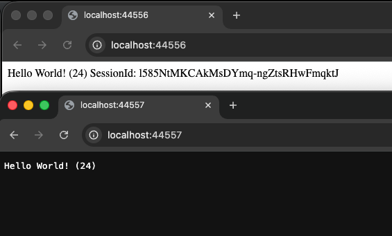

# Sharing session between NodeJS projects

## Backend1
Express server using a Memcached store

## Backend2
NodeJS HTTP server fetch the session using the session id + secret

### Run

1/ Start Memcached using Docker
```bash
sh ./memcached.sh
```

2/ Start Backend1 and retrieve the session
```bash
node ./backend1.js
```

Retrieve the session id from the browser

http://localhost:44556/

> SessionId: l585NtMKCAkMsDYmq-ngZtsRHwFmqktJ

3/ Start the backend2 using the session id

```bash
node backend2.js l585NtMKCAkMsDYmq-ngZtsRHwFmqktJ
```




This work until `kruptein@3.0.9`. After this it's not possible to decrypt the session:
> Error in crypto.get: Encrypted session was tampered with! (timing) #16

